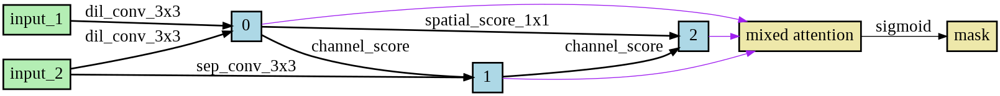

# Pytorch implementation for Attention Neural Architecture Search (ANAS)

if this code helps you, please give me a star >.<:
```
@{Dang_2019_UndergraduateThesis
author = {Dang, Anh-Chuong}
title = {Exploring Attention Convolutional Neural Network via Neural Architecture Search},
month = {August},
year = {2019}
publisher = {GitHub}
journal = {GitHub repository}
commit = {master}
}
```

## Overview
This repository contains Pytorch implementation of my undergraduate thesis.
In this project, we tried to automate the process of designing an attention module on ResNet backbone utilizing gradient decent based NAS algorithm.

## Files
```
├──anas/ - main code for ANAS modules and training
├──se_resnet_cifar/ - reimplementation of SE-ResNet for comparison
summary.pdf - brief explanation of the project
```

## Dependencies
+ Python >= 3.6
+ Pytorch >= 1.0

## Training
We use CIFAR-10/CIFAR-100 dataset for experiments

To start searching process from sratch, run ```search_net.py``` script (with arguments of your choice) in anas/ folder. Eg: ```python search_net.py --batch_size 128 --seed 1 --note exp1```.

+ After you achieved desired architecture, please copy it to namedtuple ```AttGenotype``` in ```genotypes.py``` otherwise you can use what we found to test evaluation network.

To start evaluating, run ```train_net.py``` (with arguments of your choice). Eg: ```python train_net.py --batch_size 128 --seed 1 --net_type resnet20```.

To test SEResNet performance, run ```train.py``` script in se_resnet_cifar/ (with your choices of arguments)

## Brief Summary

<center>Figure 1: Attention module architecture.</center>

|    Model        | Test err(paper) | Test err(this impl.)|
|-----------------|:---------------:|:-------------------:|
|    ResNet20     |      8.75%      |      -NA-           |
|   SEResNet20    |      -NA-       |      7.93%          |
|   ANAS20-ours   |      -NA-       |    **7.16%**        |

Please refer ```summary.pdf``` for more results and details of experiments

## Code References
This code is implemented based on:<br/>
https://github.com/quark0/darts<br/>
https://github.com/moskomule/senet.pytorch<br/>
https://github.com/akamaster/pytorch_resnet_cifar10<br/>
https://github.com/chenxin061/pdarts
